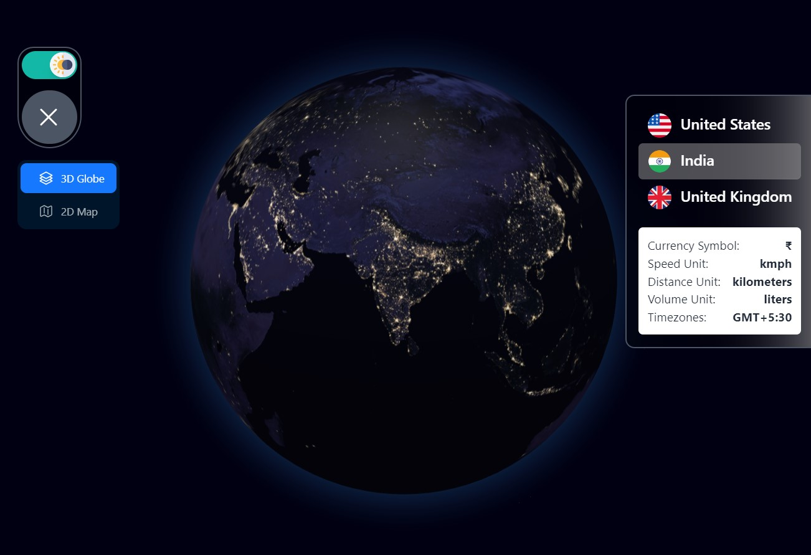

# GlobeQuest - Explore the World with Interactive Maps



## Introduction

GlobeQuest is an interactive mapping application that allows users to explore regions around the world using interactive maps. The website is live and accessible at [https://globequest.site/](https://globequest.site/). The app is built using **Next.js** and **Tailwind CSS**, providing a modern and responsive user interface.

## Features

- Interactive map with **OpenStreetMap (OSM)** integration.
- **Ant Design** for a beautiful and responsive UI.
- **Redux** for state management.
- **Light** and **Dark** mode for better user experience.
- Region information cards for displaying details.
- Form input to select a specific region.
- 3D globe using **react-globe.gl**.
- Satellite and normal map view options using **Google Maps**.
- Marker on the selected location country using **@react-google-maps/api**.

## Live Website

Visit the live website [**GlobeQuest**](https://globequest.site/) to explore the world and enjoy the interactive mapping experience.

## Installation and Usage

1. Clone the repository:

```bash
git clone https://github.com/your-username/globequest.git
cd globequest
```

2. Install dependencies:

```bash
npm install
```

3. Run the development server:

```bash
npm run dev
```

4. Open your browser and navigate to `http://localhost:3000` to access the app.

## Light and Dark Mode

GlobeQuest supports both **Light** and **Dark** modes for a personalized user experience. The theme automatically switches based on your device's preferences. Enjoy exploring the world with your preferred theme.

## Contributions

Contributions to this project are welcome. If you find any issues or have suggestions for enhancements, feel free to open issues and submit pull requests.

## Tech Stack

- **Next.js**
- **Tailwind CSS**
- **Turf.js**
- **Ant Design**
- **Redux**
- **OpenStreetMap (OSM)**
- **Google Maps**
- **@react-google-maps/api**
- **react-globe.gl**

## Folder Structure

The project is organized as follows:

```
|-- components
|   |-- DynamicMap.js
|   |-- FormInput.js
|   |-- RegionInfo.js
|   |-- GoogleMapComponent.js
|-- pages
|   |-- index.js
|-- public
|   |-- assets
|       |-- earth.jpg
|-- screenshots
|-- store
|   |-- index.js
|   |-- regionSlice.js
|-- tailwind.config.js
|-- package.json
|-- README.md
```

## License

This project is licensed under the **MIT License** - see the [LICENSE](LICENSE) file for details.

---

Thank you for visiting **GlobeQuest**! We hope you enjoy exploring the world with our interactive maps. If you have any feedback or suggestions, please feel free to reach out. Happy mapping! 🌍